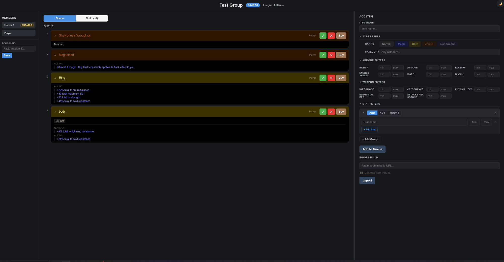

# PoeTicketQueue

A full-stack web app that coordinates item buying for Path of Exile group play.
A group leader creates a group with a shareable join code; players add item
requests to the queue using trade-style filters backed by live PoE data (base
types, stat mods, leagues); the group's traders work the queue, buying items
and marking them bought; and a Discord integration announces group activity
as it happens.



**Stack:** Java 21 · Spring Boot 3.3 · Vue 3 + Vite · Discord bot (JDA) ·
Docker Compose · CI + tagged releases to GHCR · Cloudflare Tunnel deployment

## Features

- **Groups with join codes** — create a group, share the code, members join
  with a screen name; Creator/Trader/Member roles and creator transfer.
- **Item tickets with real trade filters** — players request items using
  base-type, armour, weapon, and stat-mod filters (AND/NOT/COUNT groups)
  sourced from live Path of Exile data, so requests read like actual trade
  searches. Supports both Path of Exile 1 and 2, with league selection.
- **Trader workflow** — traders work the queue, buying requested items and
  marking them bought; per-build item lists let a player queue up a whole
  build's worth of gear.
- **pobb.in build import** — paste a build URL to import its whole item
  list into the queue at once.
- **Discord announcements** — a pluggable per-group announcement service
  (Discord/JDA implementation) notifies the group's channel on activity.
- **Light/dark theme**, single-container deployment, and an email-allowlisted
  public deployment via Cloudflare Tunnel.

## Project Structure

```
PoeTicketQueue/
├── backend/    # Spring Boot 3.3 (Java 21)
└── frontend/   # Vue 3 + Vite 5
```

## Running Locally (dev)

For active development, run the backend and frontend separately with hot reload.

### Prerequisites

- Java 21+
- Maven 3.8+
- Node.js 18+ and npm

Both the backend and frontend need to run at the same time in separate terminals.

### Backend

```bash
cd backend
mvn spring-boot:run
```

The backend starts on `http://localhost:8080`.

### Frontend

```bash
cd frontend
npm install
npm run dev
```

The frontend starts on `http://localhost:5173` and proxies `/api` requests to the backend automatically.

## Running with Docker

The app builds into a single container: the Vue frontend is compiled and served as
static resources by the Spring Boot backend, so there's just one image and one port.
Only Docker is required — no local Java/Node toolchain.

Run a published release (pulled from GHCR):

```bash
cp .env.example .env      # set APP_VERSION to a release tag, e.g. 0.1.0
docker compose up -d
```

Or build the image from local source instead of pulling:

```bash
docker compose -f docker-compose.yml -f docker-compose.build.yml up -d --build
```

Either way the app is served on `http://localhost:8080`. In this mode it runs with the
`prod` Spring profile (quieter logging, honours proxy `X-Forwarded-*` headers).

## Deployment

For exposing the app to others through a Cloudflare Tunnel with access limited to an
allow-list of emails, see **[DEPLOY.md](DEPLOY.md)**. In short:

```bash
docker compose --profile tunnel up -d
```

## Releasing

CI runs on every push and PR (`mvn verify`, the frontend build, and a Docker image
build). Pushing a version tag publishes an image to GHCR:

```bash
git tag v0.1.0
git push origin v0.1.0
# -> ghcr.io/nathanielwhittaker/poeticketqueue:{0.1.0, 0.1, latest}
```

## Notes

Group state (groups, queues, Discord config) is held **in memory** — restarting the app
clears it, and members re-create their groups afterward.
